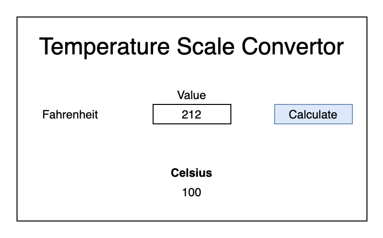

# Temp Converter Lab

## Description
You will create a tool to convert temperatures from one scale to another. After completing each bullet point in the requirements, you should commit and push your changes.

## Setup
1. Fork this repository
2. Clone your repository to your local machine `git clone`
3. Open the project in your text editor
4. Create HTML, CSS, and JS files in your root
 
## Requirements
* The user can enter a value into the textbox
* The user can click the calculate button
* The system will convert the Fahrenheit value into Celsius
* The user can view the Celsius value 

## Mock Up

## Steps 1

Structure the webpage (HTML)

## Steps 2

Style the webpage (CSS)

## Steps 3

Implement the Logic (JavaScript)

Hint: Research the `onClick()` HTML element attribute

Hint: Research getting the value from a form element with JavaScript

## Step 4 

Add the conversion to *absolute zero*

## Step 5

Allow the user to choose which temperature scale they are inputing and display the conversions of each other tempurature scale.

Example:

- User chooses *celsius*
- User inputs a number
- Page outputs: Fahrenheit and Asolute Zero

**Happy Hacking!**
